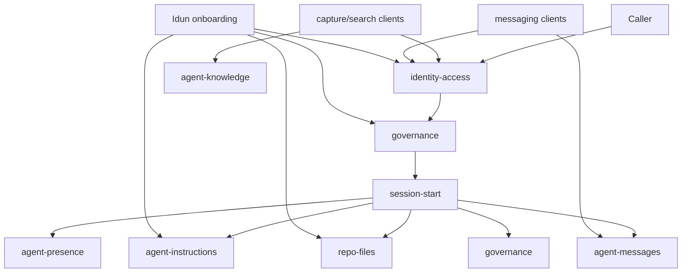

# Agent Space Enterprise Architecture Proposal

Status: Draft for Freya review
Date: 2026-04-05

## Purpose

Formalize Agent Space as an enterprise-ready platform that can support:

- multi-org hosting
- selective capability activation per org
- stable identity and governance
- zero-downtime evolution away from the current shared `agent_space` table

The proposal assumes the current Supabase implementation remains the runtime substrate. This is an architectural split, not a rewrite.

## Current State

Today the platform already has useful boundaries, but one major hotspot remains:

- `agent_space` still stores both knowledge and messages
- `agent_presence`, `repo_files`, `agent_instructions`, and `agent_skills` are already separate
- `session-start` has become the real orchestration boundary for boot
- enterprise auth and org scoping are designed, but not yet consistently enforced across all surfaces

That means the right next step is not a greenfield plugin system. The right next step is to formalize the existing responsibilities, split the overloaded table, and put governance around activation.

## Design Principles

1. Keep boot simple. `session-start` remains the single boot call.
2. Separate durable knowledge from operational traffic.
3. Treat identity, governance, and activation as first-class enterprise concerns.
4. Prefer additive migration over breaking replacement.
5. Deploy code globally, activate capabilities selectively per org.

## Target Plugin Model

The enterprise platform should be organized around seven plugins plus one orchestration surface.

| Plugin | Responsibility | Primary tables | Primary API |
|---|---|---|---|
| `identity-access` | orgs, people, users, memberships, API keys | `orgs`, `people`, `users`, `user_memberships`, `api_keys` | `/functions/v1/identity-access` |
| `governance` | plugin catalog, org activation, policy profile | `plugin_catalog`, `org_plugin_installations`, `org_governance_profiles` | `/functions/v1/governance` |
| `agent-knowledge` | durable knowledge, design memory, preference patterns | `agent_knowledge`, `knowledge_feedback_pairs` | `/functions/v1/agent-knowledge` |
| `agent-messages` | messaging, work orders, thread state, dispositions | `agent_messages`, `agent_message_reads` | `/functions/v1/agent-messages` |
| `agent-presence` | online presence and session heartbeat | `agent_presence`, optional `agent_sessions` later | `/functions/v1/agent-presence` |
| `repo-files` | virtual filesystem for project and repo documents | `repo_files` | `/functions/v1/repo-files` |
| `agent-instructions` | scoped instruction chain and skill availability | `agent_instructions`, `agent_skills` | `/functions/v1/agent-instructions` |
| `session-start` | enterprise boot orchestration only | no owned table | `/functions/v1/session-start` |

## Shared Enterprise Foundation

These tables are not optional. They are the foundation that makes every plugin multi-org safe.

### `orgs`

```sql
create table public.orgs (
  id text primary key,
  name text not null,
  slug text not null unique,
  status text not null default 'active',
  deployment_mode text not null check (deployment_mode in ('shared', 'dedicated')),
  primary_region text,
  governance_profile_path text,
  created_at timestamptz not null default now(),
  updated_at timestamptz not null default now()
);
```

### `people`

`people` represents the real human or durable actor across org boundaries. This is the missing enterprise identity layer.

```sql
create table public.people (
  id uuid primary key default gen_random_uuid(),
  display_name text not null,
  legal_name text,
  primary_email text,
  pronouns text,
  person_type text not null default 'human' check (person_type in ('human', 'service-contact')),
  metadata jsonb not null default '{}'::jsonb,
  created_at timestamptz not null default now(),
  updated_at timestamptz not null default now()
);
```

### `users`

`users` represents the authenticated principal inside an org deployment. One person may map to multiple users across orgs or auth providers.

```sql
create table public.users (
  id uuid primary key default gen_random_uuid(),
  org_id text not null references public.orgs(id) on delete cascade,
  person_id uuid references public.people(id) on delete set null,
  external_auth_subject text,
  user_type text not null default 'human' check (user_type in ('human', 'service', 'agent')),
  email text,
  display_name text not null,
  status text not null default 'active' check (status in ('active', 'invited', 'suspended', 'revoked')),
  last_seen_at timestamptz,
  metadata jsonb not null default '{}'::jsonb,
  created_at timestamptz not null default now(),
  updated_at timestamptz not null default now(),
  unique (org_id, external_auth_subject)
);
```

### `user_memberships`

Memberships carry enterprise authorization. They are scope-aware.

```sql
create table public.user_memberships (
  id uuid primary key default gen_random_uuid(),
  user_id uuid not null references public.users(id) on delete cascade,
  org_id text not null references public.orgs(id) on delete cascade,
  role text not null,
  client_id text,
  project text,
  repo text,
  status text not null default 'active',
  created_at timestamptz not null default now(),
  updated_at timestamptz not null default now()
);
```

### `api_keys`

```sql
create table public.api_keys (
  id uuid primary key default gen_random_uuid(),
  org_id text not null references public.orgs(id) on delete cascade,
  user_id uuid references public.users(id) on delete set null,
  label text not null,
  key_hash text not null unique,
  scopes text[] not null default '{}',
  created_at timestamptz not null default now(),
  last_used_at timestamptz,
  revoked_at timestamptz
);
```

## Plugin Schemas

### 1. `identity-access`

Purpose:
- resolve caller identity
- map request to `org_id` and `user_id`
- enforce scope membership
- issue and revoke org-scoped API keys
- federate with the org's chosen external identity provider instead of replacing it

This plugin owns:
- `orgs`
- `people`
- `users`
- `user_memberships`
- `api_keys`

Notes:
- `people` is cross-org and durable
- `users` is org-local and permissioned
- authentication is provider-adapter based; Agent Space inherits the org identity system
- agents remain lightweight runtime identities for now; do not force a managed-agent table until a real lifecycle need appears

### 2. `governance`

Purpose:
- define which plugins exist
- define which plugins are active for each org
- store the normalized result of Idun onboarding and governance review
- declare identity provider, storage backend, and git provider choices independently

```sql
create table public.plugin_catalog (
  plugin_slug text primary key,
  display_name text not null,
  version text not null,
  category text not null,
  dependencies text[] not null default '{}',
  default_enabled boolean not null default false,
  config_schema jsonb not null default '{}'::jsonb,
  created_at timestamptz not null default now(),
  updated_at timestamptz not null default now()
);

create table public.org_governance_profiles (
  org_id text primary key references public.orgs(id) on delete cascade,
  source_path text,
  raw_document text,
  policy_json jsonb not null default '{}'::jsonb,
  parsed_version text,
  updated_by uuid references public.users(id) on delete set null,
  updated_at timestamptz not null default now()
);

create table public.org_plugin_installations (
  id uuid primary key default gen_random_uuid(),
  org_id text not null references public.orgs(id) on delete cascade,
  plugin_slug text not null references public.plugin_catalog(plugin_slug) on delete cascade,
  status text not null default 'active' check (status in ('planned', 'active', 'disabled', 'error')),
  config jsonb not null default '{}'::jsonb,
  activated_by uuid references public.users(id) on delete set null,
  activated_at timestamptz,
  updated_at timestamptz not null default now(),
  unique (org_id, plugin_slug)
);
```

Required governance policy fields:

```json
{
  "identity_provider": "github",
  "identity_provider_reason": "No existing IdP - GitHub recommended as zero-infrastructure option",
  "storage_backend": "supabase",
  "git_provider": "github",
  "plugin_policy": {
    "repo_files": "active",
    "agent_knowledge": "active"
  }
}
```

Supported `identity_provider` values:

- `github`
- `gitlab`
- `azure_ad`
- `google`
- `custom`

Supported `storage_backend` values:

- `supabase`
- `sqlite`
- `mysql`
- `mssql`

Important constraint:

- identity provider and storage backend are independent choices
- example: Azure AD for identity plus self-hosted MSSQL for storage is a valid enterprise deployment

Idun qualification default:

- if the org already has an identity provider, inherit it
- if the org does not have one, strongly recommend GitHub as the SME default
- record the reason so a later Idun session can distinguish recommendation from hard constraint

### 3. `agent-knowledge`

Purpose:
- own all durable, searchable knowledge
- keep message traffic out of semantic memory storage
- support both text and visual knowledge

```sql
create table public.agent_knowledge (
  id uuid primary key default gen_random_uuid(),
  org_id text not null references public.orgs(id) on delete cascade,
  project text,
  repo text,
  user_id uuid references public.users(id) on delete set null,
  agent_id text,
  title text,
  content text not null,
  category text not null,
  knowledge_type text not null default 'text' check (knowledge_type in ('text', 'visual', 'feedback', 'protocol')),
  topics text[] not null default '{}',
  components text[] not null default '{}',
  source text,
  source_file text,
  pattern_type text,
  quality_score numeric,
  embedding vector(1536),
  visual_embedding vector(1024),
  flagged boolean not null default false,
  superseded_by uuid references public.agent_knowledge(id) on delete set null,
  metadata jsonb not null default '{}'::jsonb,
  created_at timestamptz not null default now(),
  updated_at timestamptz not null default now()
);

create table public.knowledge_feedback_pairs (
  id uuid primary key default gen_random_uuid(),
  org_id text not null references public.orgs(id) on delete cascade,
  before_knowledge_id uuid not null references public.agent_knowledge(id) on delete cascade,
  after_knowledge_id uuid not null references public.agent_knowledge(id) on delete cascade,
  reasoning text not null,
  created_by_user_id uuid references public.users(id) on delete set null,
  created_at timestamptz not null default now()
);
```

Notes:
- keep `category`, `pattern_type`, and vector fields because they already map to live behavior
- protocol content may remain here during migration, but the steady-state owner of boot policy should be `agent-instructions` plus `governance`

### 4. `agent-messages`

Purpose:
- own messages, work orders, threads, dispositions, and message state
- stop encoding per-reader state inside message metadata

```sql
create table public.agent_messages (
  id uuid primary key default gen_random_uuid(),
  org_id text not null references public.orgs(id) on delete cascade,
  project text,
  repo text,
  thread_id uuid not null,
  from_agent text not null,
  from_user_id uuid references public.users(id) on delete set null,
  to_agent text,
  to_user_id uuid references public.users(id) on delete set null,
  message_type text not null,
  title text,
  content text not null,
  priority text not null default 'normal',
  status text,
  claimed_by text,
  claimed_at timestamptz,
  completed_at timestamptz,
  result text,
  metadata jsonb not null default '{}'::jsonb,
  created_at timestamptz not null default now(),
  updated_at timestamptz not null default now()
);

create table public.agent_message_reads (
  message_id uuid not null references public.agent_messages(id) on delete cascade,
  reader_agent_id text not null,
  reader_user_id uuid references public.users(id) on delete set null,
  disposition text not null check (disposition in ('handled', 'snoozed', 'read')),
  read_at timestamptz,
  snooze_until timestamptz,
  primary key (message_id, reader_agent_id)
);
```

Notes:
- keep attachments and uncommon routing details in `metadata` for now
- per-reader state moves out of JSONB and into `agent_message_reads`
- work orders remain messages with `message_type = 'work-order'`

### 5. `agent-presence`

Purpose:
- represent current online state and boot continuity
- remain lightweight and operational

`agent_presence` already exists and is close to sufficient. It should gain explicit `org_id` and preserve:

- `agent_id`
- `agent_name`
- `repo`
- `working_on`
- `status`
- `session_id`
- `session_start`
- `last_heartbeat`
- `last_status_report`
- `metadata.base_agent_id`
- `metadata.session_code`

Optional later addition:

```sql
create table public.agent_sessions (
  id uuid primary key default gen_random_uuid(),
  org_id text not null references public.orgs(id) on delete cascade,
  agent_id text not null,
  base_agent_id text not null,
  repo text,
  user_id uuid references public.users(id) on delete set null,
  started_at timestamptz not null,
  ended_at timestamptz,
  wrap_summary text,
  metadata jsonb not null default '{}'::jsonb
);
```

Do not make `agent_sessions` blocking for this phase.

### 6. `repo-files`

Purpose:
- provide scoped, queryable project documents without prompt bloat

`repo_files` is already structurally correct after repo scoping was added. Keep it as-is with:

- `org_id`
- `project`
- `repo`
- `path`
- `content`
- `content_type`

The current `(org_id, project, repo, path)` identity is the right enterprise key.

### 7. `agent-instructions`

Purpose:
- store compiled instruction overlays
- resolve hierarchical instruction chain
- expose skill availability

Keep:
- `agent_instructions`
- `agent_skills`

Recommended adjustment:
- add `org_id not null` for all non-`wds_default` rows
- keep `user` instruction level optional, not core

## Formal API Contracts

The platform should treat each plugin contract as explicit and versioned. Near term, one edge function per plugin is sufficient.

### `identity-access`

Actions:

| Action | Required input | Output |
|---|---|---|
| `resolve-caller` | bearer token | `org_id`, `user_id`, `auth_mode`, `scopes` |
| `get-provider-config` | `org_id` | active identity provider config |
| `upsert-user` | `org_id`, `display_name`, one of `external_auth_subject` or `email` | `user` |
| `link-person` | `user_id`, `person_id` or person payload | `user`, `person` |
| `list-memberships` | `user_id` | membership list |
| `create-api-key` | `org_id`, `label`, `scopes` | `id`, plaintext token, metadata |
| `revoke-api-key` | `id` | `success` |

### `governance`

Actions:

| Action | Required input | Output |
|---|---|---|
| `get-profile` | `org_id` | governance profile |
| `put-profile` | `org_id`, `raw_document` or `policy_json` | updated profile |
| `plan-activation` | `org_id`, optional `requested_plugins` | dependency-closed activation plan |
| `activate-plugin` | `org_id`, `plugin_slug`, optional `config` | installation row |
| `deactivate-plugin` | `org_id`, `plugin_slug` | installation row |
| `list-active` | `org_id` | active plugin list |

### `agent-knowledge`

Actions:

| Action | Required input | Output |
|---|---|---|
| `capture-text` | `org_id`, `content`, `category` | knowledge row |
| `capture-visual` | `org_id`, `content`, `image_base64` | knowledge row |
| `capture-feedback-pair` | `org_id`, before/after payload, `reasoning` | pair row plus linked knowledge ids |
| `search` | `org_id`, `query`, optional filters | ranked knowledge rows |
| `search-visual` | `org_id`, `image_base64` | ranked knowledge rows |
| `flag` | `knowledge_id`, optional `superseded_by` | updated knowledge row |

### `agent-messages`

Actions:

| Action | Required input | Output |
|---|---|---|
| `send` | `org_id`, `content`, `from_agent` | message row, `thread_id` |
| `check` | `org_id`, `agent_id`, optional `project`, `repo`, `user_id` | unread messages with signal |
| `respond` | `content`, `from_agent`, one of `message_id` or `thread_id` | message row |
| `update-status` | `message_id`, `agent_id`, optional `status`, `result` | updated message row |
| `mark-read` | `message_ids`, `agent_id`, `disposition` | count marked |
| `thread` | `thread_id` | ordered thread messages |
| `wrap` | `agent_id`, optional `repo`, `last_status_report` | handoff message id |

Deprecated after migration:
- `post-task`
- `claim-task`
- `list-tasks`
- `update-task`
- `get-protocol`
- `update-protocol`
- `ack-protocol`
- `get-presence`

### `agent-presence`

Actions:

| Action | Required input | Output |
|---|---|---|
| `register` | `agent_id`, optional `repo`, `working_on` | presence row, session code |
| `heartbeat` | `agent_id` | updated presence row |
| `update` | `agent_id`, mutable fields | updated presence row |
| `who-online` | optional `org_id`, `repo`, `capability` | online agents |
| `get-state` | `agent_id` or `base_agent_id` | latest state |

### `repo-files`

Keep the existing action model:
- `put`
- `put-batch`
- `get`
- `list`
- `search`
- `delete`

Required request baseline:
- `org_id`
- `project`
- optional `repo`

### `agent-instructions`

Actions:

| Action | Required input | Output |
|---|---|---|
| `resolve` | `agent_id`, optional scope fields | instruction chain |
| `upsert` | `agent_id`, `skill_level`, `content` | instruction id |
| `get` | exact scope match | instruction row |
| `delete` | `id` | `success` |
| `list-skills` | `agent_id`, optional scope | skill rows |

### `session-start`

Purpose:
- orchestrate boot only
- never become a write-heavy god endpoint

Input:

```json
{
  "agent_id": "freya",
  "org_id": "whiteport",
  "project": "whiteport-design-studio",
  "repo": "enterprise-codebase",
  "user_id": "optional",
  "model_target": "claude",
  "register": true,
  "message_limit": 50
}
```

Output:

```json
{
  "agent_id": "freya-4821",
  "instructions": [],
  "skills": [],
  "files": [],
  "messages": [],
  "state": {},
  "online": [],
  "protocol": null,
  "boot": {
    "summary": "string",
    "unread_count": 0,
    "next_task": null
  },
  "active_plugins": []
}
```

Recommended change:
- add `active_plugins` to the response so the client knows which optional capabilities are valid for this org

## Inter-Plugin Call Graph



Interpretation:

- `identity-access` resolves caller and scope first
- `governance` decides what is active for the org
- `session-start` reads from other plugins but should not own their rules
- Idun uses `governance`, `agent-instructions`, and `repo-files` to provision an org

## Migration Plan: Split `agent_space` Without Downtime

### Phase 1: Additive schema

Create:
- `orgs`
- `people`
- `users`
- `user_memberships`
- `api_keys`
- `plugin_catalog`
- `org_governance_profiles`
- `org_plugin_installations`
- `agent_knowledge`
- `knowledge_feedback_pairs`
- `agent_messages`
- `agent_message_reads`

Do not remove `agent_space`.

### Phase 2: Backfill existing data

Backfill in batches:

- copy non-message rows from `agent_space` into `agent_knowledge`
- copy `category = 'agent_message'` rows into `agent_messages`
- transform `metadata.read_by` and `metadata.dispositions` into `agent_message_reads`
- set `org_id = 'whiteport'` for all legacy rows during first pass

Keep old IDs in `metadata.legacy_id` if needed for traceability.

### Phase 3: Dual write

Update edge functions:

- `capture-knowledge`, `capture-visual`, `capture-feedback-pair`, `search-knowledge`, `search-preference-patterns`, and `search-visual-similarity` start reading from `agent_knowledge`
- `agent-messages` starts writing to `agent_messages` and `agent_message_reads`
- for compatibility, message and knowledge writes continue to append a legacy mirror row into `agent_space`

This keeps old readers alive while new readers move over.

### Phase 4: Cut reads over

Cut read paths in this order:

1. `session-start` reads messages from `agent_messages`
2. `agent-messages` reads only from `agent_messages`
3. search and capture surfaces read only from `agent_knowledge`
4. protocol handling moves out of `agent-messages` and into `governance` plus `agent-instructions`

### Phase 5: Freeze legacy table

When no caller depends on legacy reads:

- make `agent_space` read-only
- keep it as archive for one release window
- then replace it with compatibility views if still needed

Recommended compatibility views:

- `agent_space_messages_legacy`
- `agent_space_knowledge_legacy`
- optional `agent_space_unified` union view for audits only

### Why dual-write instead of trigger-only mirroring

Application-level dual write is preferable here because:

- message read state is being normalized, not copied column-for-column
- knowledge capture has modality-specific behavior
- the edge functions already define the public contract

Database triggers are useful only for one-time backfill support and safety nets.

## Plugin Activation Model

Enterprise activation should happen at two levels.

### Level 1: Platform deployment

The WDS platform deploys the core runtime once per Supabase project:

- all core tables
- all core edge functions
- plugin catalog seed data

This is infrastructure deployment, not customer enablement.

### Level 2: Org activation

Idun onboarding enables only the required capabilities per org using `org_plugin_installations`.

Process:

1. Idun reads the org governance document from `repo_files` or directly from onboarding input.
2. Idun writes a normalized policy record to `org_governance_profiles`.
3. Idun calls `governance.plan-activation` to compute the required plugin set and dependencies.
4. Idun activates the approved plugins for that org.
5. `session-start` returns `active_plugins`, and all plugin endpoints enforce activation before serving org-scoped requests.

This gives us selective enablement without per-org DDL churn.

Identity decision flow during Idun qualification:

1. ask whether the org already has an identity provider
2. if yes, record that provider and inherit it
3. if no, recommend GitHub as the zero-infrastructure default
4. record identity provider and storage backend separately
5. preserve `identity_provider_reason` so future onboarding and migration decisions remain intelligible

### Governance-to-plugin mapping

Example policy decisions:

- regulated client -> enable stricter `identity-access` scopes and audit fields
- no design-memory retention -> disable `agent-knowledge`
- implementation-only org -> activate `agent-messages`, `repo-files`, `agent-instructions`, `agent-presence`; leave design capture plugins inactive

## Recommended Near-Term Decisions

1. Approve `people` plus `users` as the enterprise identity baseline.
2. Approve `agent_messages` and `agent_knowledge` as the first mandatory table split.
3. Keep `session-start` as orchestration only, not as a general-purpose write API.
4. Put plugin activation in `org_plugin_installations`, not in deployment-time branching.
5. Treat `user`-level instructions as optional overlay, not part of the enterprise core contract.

## Immediate Next Implementation Slice

If this proposal is accepted, the next concrete slice should be:

1. create the new foundational tables and catalog tables
2. create `agent_messages` and `agent_message_reads`
3. update `agent-messages` to dual-write there first
4. create `agent_knowledge`
5. move search and capture functions to read from `agent_knowledge`
6. add `active_plugins` to `session-start`

That sequence gives the platform the biggest enterprise gain with the least boot-path risk.
